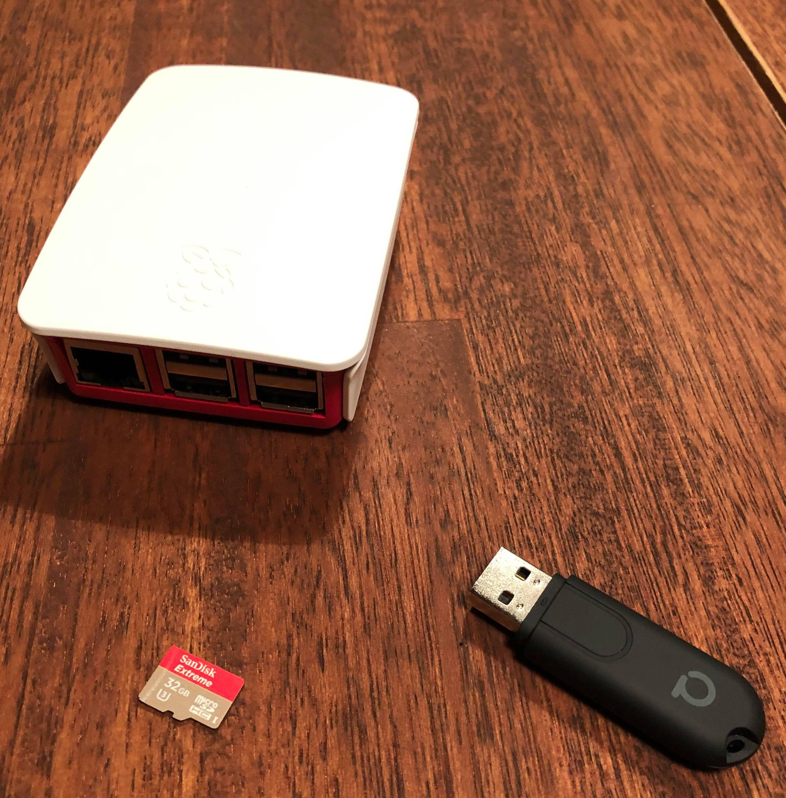
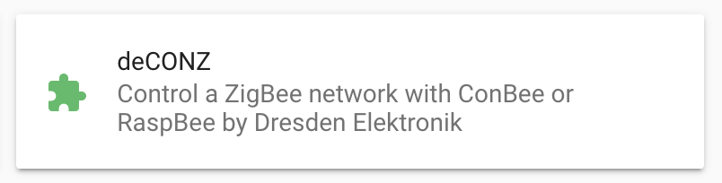
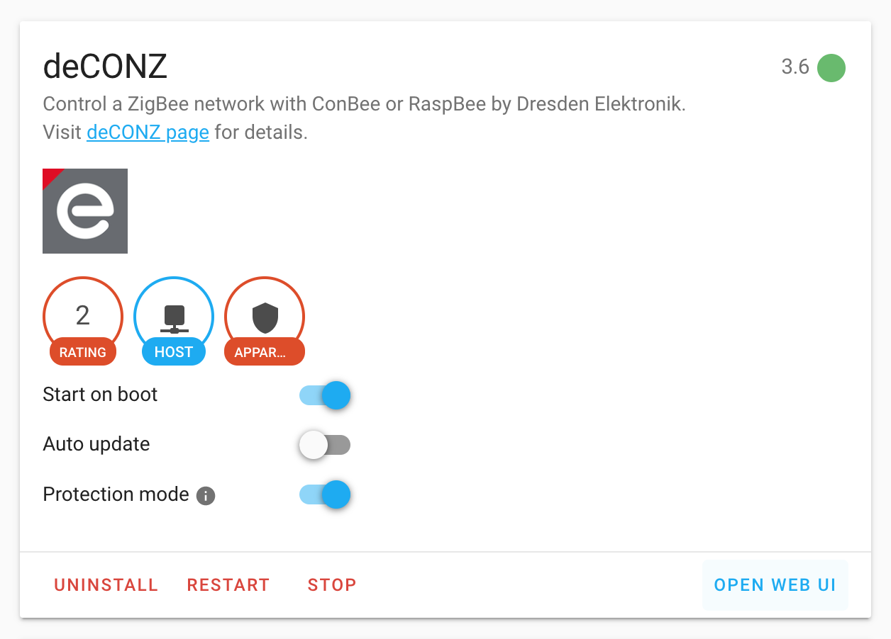
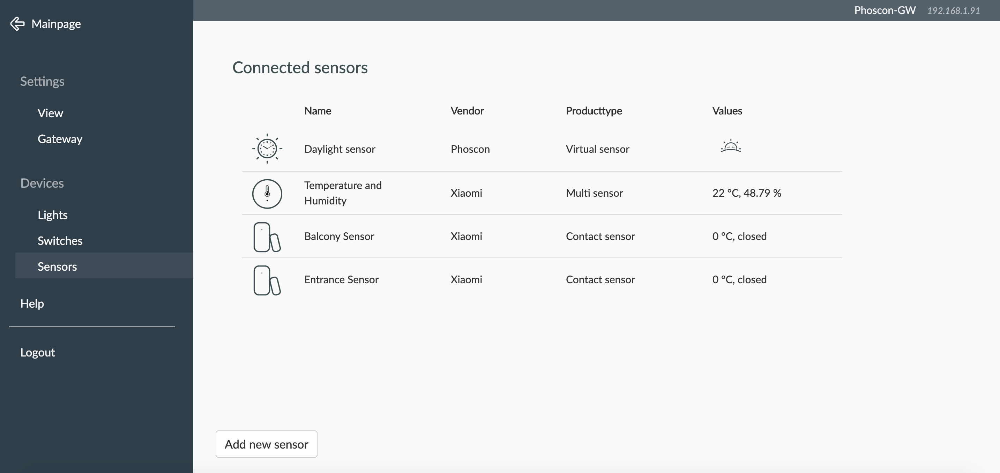
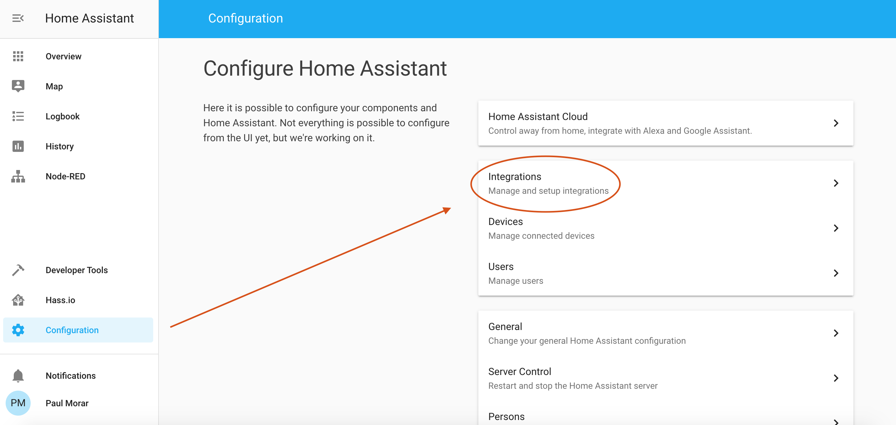
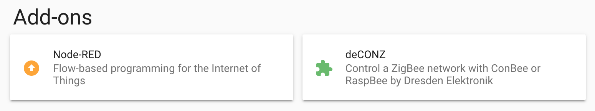
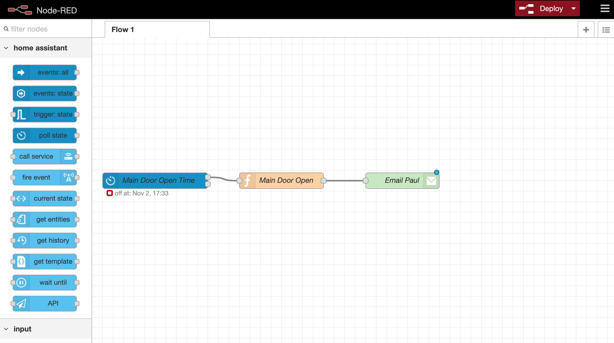

Nowadays we have all kinds of home automation setups that work out of the box. For example Philips Hue came out with the light automation system. Recently IKEA added automated blinders on top of their lighting setup. But Xiaomi is way ahead of them all and has the most extensive solution for home automation.

You can have all of these systems running in parallel in your home, but there is one catch. All of them have their own hub. Because I live in an apartment, space is important, so I wanted to see if I can combine all of these into one, self controlled hub. A friend of mine suggested to go with [Home Assistant](https://www.home-assistant.io/hassio/) as the solution is super extensive and can handle everything you throw at it. Besides that, the software is free and open source. So here I am writing about my experience and setup of this system.

In this post I am going cover the basics of the setup, as this can become extremely advanced.

The main components needed for this are as follows:

- A raspberry PI 3 or above
- A ConBee 2 universal zigBee gateway
- A 32GB MicroSD high speed card



Secondary components - these are highly dependant on your needs:

- Two Xiaomi Mijia door sensors
- Xiaomi temperature and humidity sensor
- Ikea multicolor smart light

I had a raspberry PI 3 - 64bit model laying around, and used that one. I am currently waiting for a raspberry PI 4, as it has much more processing power, and rumour has it that it is supporting USB booting out of the box 🤷‍.

You might wonder why I mentioned USB booting. I find it as a cheap option and long term, it is a more robust choice. As a read/write comparison I can point you to [this video](https://youtu.be/-4LSWGnmh0g).

One other thing that I need to mention is that I tried my setup with 2 high speed MicroSD cards, both from Sandisk. One was “Ultra” and the other was “Extreme”. My whole system was running faulty and had connectivity issues with the one marked as “Ultra”, while the other one worked like a charm. Of course there is a difference in price, but for me that was the difference between my setup working or not.


Most of devices and sensors nowadays communicate over the zigbee protocol. In my setup I decided to go with ConBee 2 universal zigbee gateway as it also works as an agnostic solution that can be plugged into any device. In order to facilitate this, it has it’s own interface.
There are many zigbee gateway solutions out there, and some of them are much cheaper than this, but I wanted my system to be stable and this also has a better range.

## Installation

For the main installation you can follow the steps on the official page:
https://www.home-assistant.io/hassio/installation/.

After the main installation, you should have the home assistant up and running. Now we need to basically integrate everything together, and a large part of this will be sending your sensor data from your ConBee device to Home Assistant.

For this you need to plug the ConBee device into your raspberry PI and boot it up. After that you need to install the deConz plugin from the Add-On Store.



After the plugin is installed you need to change the configuration(there is a dedicated Config section) into this:

```js
  {
    "device": "/dev/ttyACM0",
    "vnc_password": ""
  }
```

Go back to the top of the plugin page, shich should be looking like below.



Press restart and wait. After the restart, you can click on Open Web UI button. That will open the ConBee interface. After setting up your gateway you can start adding your sensors. Go to `Menu -> Sensors -> Add new sensor` and start pairing your sensors with the gateway. After pairing, this is how my setup looks:



You can follow the same process for the lights or/and switches.

After the pairing, you need to send the sensor/light/switch data to Home Assistant. Go to `Menu -> Gateway -> Advanced` and then press Authenticate App.

Go back to your Home Assistant screen and go to `Configure -> Integrations` as shown in the image below.



There, you will need to add a new integration for deConz ZigBee gateway.


Usually, Home Assistant autodetects these integrations and will suggest you to take action and configure them.

This is the last part of your setup, because after configuring this integration you have access to your sensors from within Home Assistant and you can move forward and automate your home.

## Automation Example using Node-Red

For specific automation rules I use another plugin called Node-RED. You can get that plugin the from the Add-on store as well.



Let’s look at something simple - my very first automation that I wrote using this tool. I started out with laying down the problem: I don’t want to forget my main door open. For that, I needed my system to notify me whenever the door stays open for more than 5 minutes.
This is the Node-RED flow:



When the state of my sensor changes, it triggers a function node and based on that output I execute an email task.

This is how my function looks like:

```js
// Check if opened less than 5 minutes -> no change
if (msg.data.timeSinceChangedMs < 30000) {
  flow.set("awayOver5", 0) // Reset
  return null
}
// Check if already away more than 5 minutes
if (flow.get("awayOver5") == 1) {
  return null
}
flow.set("awayOver5", 1)
// Send email
msg = {
  payload: "You forgot the door opened at " + Date().toString(),
  topic: "Main Door Open",
}
return msg
```

In case the code returns a message, I will end up getting an email telling me that I forgot my door open.

Let me know on [twitter](https://twitter.com/paulmorar) if you want me to elaborate more on the Node-RED automation flows, debugging and all the likes.
